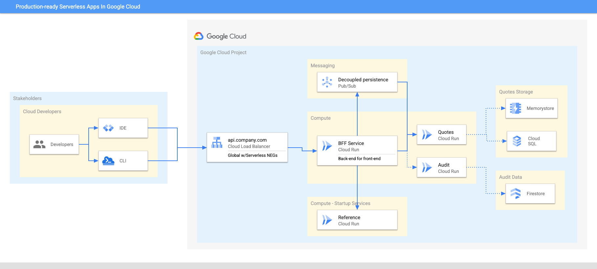

# Serverless Production Readiness and Optimization for Java in Google Cloud

> **🧪 Status: living repo** - All code samples are deployable in Cloud Run `at all times` and will constantly be updated with new versions, features and use additional Google Cloud  Services.  

**Description**
This material provides guidelines, best practices and samples focused on `production-ready, optimized, modern Java applications deployed in Cloud Run in GCP`

## Features
There are multiple aspects to `writing effective services for serverless production environments` and they all revolve around the combination of service design, implementation, testing, configuration with environment configuration and optimization best practices.

The material dives into two areas: 
### How to think about production-readiness
You generally think that a **production-ready cloud service must be:**
* Stable and Reliable
* Scalable and Performant
* Fault Tolerant without any single point of failure
* Properly Monitored
* Documented and Understood
* Properly secured

### How to think about optimization
Optimizing any app for Cloud Run requires a balance of different aspects to be considered, therefore it is important to always have a clear picture of **what it is that you are optimizing for**:
* start-up time
* execution latency
* resource consumption (memory & CPU)
* concurrency
* image size
* easy maintainability
* lower costs

## Getting Started
Clone this Git repository:
```shell
git clone https://github.com/ddobrin/serverless-production-readiness-java-gcp.git
```
or open the repo directly in Cloudshell:

[](https://ssh.cloud.google.com/cloudshell/editor?cloudshell_git_repo=https://github.com/ddobrin/serverless-production-readiness-java-gcp.git)

### Prerequisites
* `Machine`:
  * The code is constantly being tested on MacBooks and Linux environments
  * Test in your Windows machine, if preferred
* The `IDE` of your choice
* `Java 17` - latest LTS 
  * Install via [SDKMan](https://sdkman.io/install) or your favorite package manager
* `GraalVM` for building Native Java Images 
  * Install via SDKMan - `sdk install java 17.0.7-graal`
  * Install directly from [GraalVM Download](https://www.graalvm.org/downloads/) site
* `API Testing`
  * Use [cURL](https://curl.se/) or
  * [HTTPie](https://httpie.io/)

### Sample services 
A set of services is provided to illustrate the various concepts, following the architecture below.

All services are documented and can be built from a single script as per [README.md](services/README.md) in the `services` folder.

Each service can be built/tested/deployed individually or as part of the entire architecture
* [Quotes](services/quotes/README.md) Service - manage quotes from famous books, persisted in CloudSQL (Postgres)
* [Audit](services/audit/README.md) Service - audit updates (persisted in Firestore)
* [Reference](services/reference/README.md) Service - invoked by BFF service at start-up, to read reference data
* [Faulty](services/faulty/README.md) Service - illustrate a faulty service for resiliency purposes
* [BFF](services/bff/README.md) Service - Backend-for-frontend service for downstream services



## Contributing

Contributions to this library are always welcome and highly encouraged.

See [CONTRIBUTING](CONTRIBUTING.md) for more information how to get started.

Please note that this project is released with a Contributor Code of Conduct. By participating in
this project you agree to abide by its terms. See [Code of Conduct](CODE_OF_CONDUCT.md) for more
information.

## License

Apache 2.0 - See [LICENSE](LICENSE) for more information.