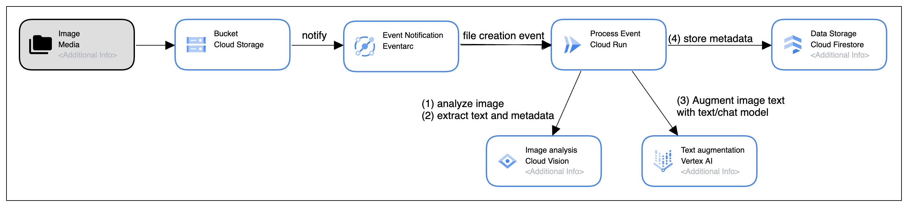

# GenAI Samples

## Use-case - Image analysis and Text Augmentation using Vision API, Langchain4J and Vertex AI, as Jit and Native Java applications
#### [Source Code, Build and Deploy Instructions - Java 21](image-vision-vertex-langchain/README.md)

In this use case:
* Store a picture in a Google Cloud Storage bucket
* File creation event is generated
* EventArc triggers a service deployed in Cloud Run
* Services calls [Vision API](https://cloud.google.com/vision?hl=en) to analyze the image for safety, extract image metadata and any text within the image
* For any text identified in an image, the service builds a prompt for Vertex AI to retrieve more information about the text
* Service uses [Langchain4J](https://github.com/langchain4j/langchain4j) for the interaction with [Vertex AI](https://cloud.google.com/vertex-ai?hl=en#section-1)
* Two versions of the data augmentation calls are provided, as examples: 
  * (1) using a [TextModel](https://cloud.google.com/vertex-ai/docs/generative-ai/model-reference/text) - `text-bison` 
  * (2) using a [Chat Model](https://cloud.google.com/vertex-ai/docs/generative-ai/model-reference/text-chat) - `chat-bison`

